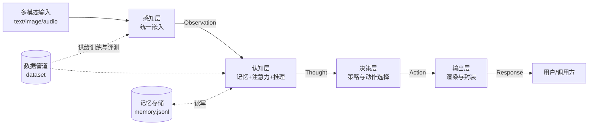

# AGI-Core 总体架构设计书

> 版本：v1.0 ｜ 作者：林图灵（首席架构师）｜ 日期：2026-09-02
> 状态：Phase 1 交付物 ｜ 上游依据：`GOAL.md` ｜ 下游读者：阿瑟/凯文/莎拉/诺亚

## 0. 设计目标与原则

**目标**：在纯本地 CPU 环境（无 GPU、无外网、无外部 API）下，构建可运行、可演示、可演进的多模态认知智能原型系统。

**六项原则**：
1. **分而治之**：感知/认知/决策/输出四层解耦，层间仅通过 JSON 契约通信；
2. **契约先行**：接口定义先于代码实现，各模块可独立开发与测试（接口见 §3）；
3. **降级内建**：所有算法均设计「完整版 + CPU 简化版」双路径，简化版为默认实现；
4. **可演进性**：接口与数据格式版本化（`version` 字段），未来可替换重型实现而不动架构；
5. **纵切优先**：优先打通端到端最小闭环（MVP），再横向增强各层能力；
6. **全程可追溯**：每次请求保留认知轨迹（trace），保证决策可解释、可验收。

## 1. 系统分层架构

### 1.1 分层总览（ASCII 图）

```
┌────────────────────────────────────────────────────────────────┐
│                        ① 感知层 Perception                       │
│  文本输入 ─┐                                                    │
│  图像输入 ─┼─→ 多模态编码器(文本/视觉/语音 → 统一嵌入空间)          │
│  语音输入 ─┘        │  产出: Observation(JSON)                   │
└─────────────────────┼──────────────────────────────────────────┘
                      ▼
┌────────────────────────────────────────────────────────────────┐
│                        ② 认知层 Cognition                        │
│  ┌──────────────┐ ┌──────────────┐ ┌──────────────────────┐     │
│  │ 记忆 Memory   │ │ 注意力 Attn   │ │ 推理 Reasoning        │     │
│  │ 工作记忆/情景/ │ │ 跨模态加权    │ │ 链式思考+检索增强      │     │
│  │ 语义三层记忆   │ │ 相关性评分    │ │ (ReAct-lite)         │     │
│  └──────┬───────┘ └──────┬───────┘ └──────────┬───────────┘     │
│         └────────────────┼─────────────────────┘                │
│                          ▼  产出: Thought(JSON)                  │
└──────────────────────────┼──────────────────────────────────────┘
                           ▼
┌────────────────────────────────────────────────────────────────┐
│                        ③ 决策层 Decision                         │
│  策略规划(意图→动作路由) ｜ 置信度门控 ｜ 动作选择(reply/tool/none)   │
│                          │  产出: Action(JSON)                   │
└──────────────────────────┼──────────────────────────────────────┘
                           ▼
┌────────────────────────────────────────────────────────────────┐
│                        ④ 输出层 Output                           │
│  文本生成/模板渲染 ｜ 认知轨迹(trace)导出 ｜ 结构化响应封装          │
│                          │  产出: Response(JSON)                 │
└──────────────────────────┼──────────────────────────────────────┘
                           ▼
                    ┌──────────────┐
                    │   终端/用户    │   ← 全链路由统一 API(src/api)调度
                    └──────────────┘
```

### 1.2 数据流（mermaid）



## 2. 模块划分与职责

| 模块 | 目录 | 负责人 | 核心职责 | 交付物 |
|---|---|---|---|---|
| **M1 认知核心** | `src/cognition/` | 阿瑟 | 注意力机制、三层记忆（工作/情景/语义）、链式推理；输入 Observation，输出 Thought | `docs/algorithm-design.md` + 可运行代码 + 自测 |
| **M2 多模态** | `src/multimodal/` | 莎拉 | 文本/视觉/语音三模态编码与跨模态语义对齐（共享嵌入空间） | 方案文档 + 对齐模块 + 自测 |
| **M3 数据管道** | `data/` | 凯文 | 示例数据集构建（≥200 条）、质量评估、训练/评测数据供给 | `build_dataset.py` + dataset + `quality_report.md` |
| **M4 集成 API** | `src/api/`、`demo/` | 诺亚 | 统一调度入口、四层编排、会话管理、错误处理、一键演示 | `api-spec.md` + 调度代码 + `run_demo.py` |

**边界约定**：M1/M2/M3 之间禁止直接 import，一律经 M4 调度或文件传递；共享数据格式以本文档 §3 契约为唯一标准。

## 3. 模块间接口定义

### 3.1 统一消息封装（Envelope）

所有跨模块调用一律采用如下 JSON 信封（`version` 用于演进兼容）：

```json
{
  "msg_id": "uuid4",
  "ts": "2026-09-02T15:20:00+08:00",
  "src": "perception",
  "dst": "cognition",
  "type": "observation",
  "version": "1.0",
  "payload": {},
  "error": null
}
```

统一错误码：`0=OK`；`1xxx=感知层`；`2xxx=认知层`；`3xxx=数据管道`；`4xxx=API/集成`。
调用方式：本地 Python 函数调用（入参/出参均为可 JSON 序列化对象）；预留 `HTTP POST` 适配位，接口签名不变。

### 3.2 核心接口契约

**I1 多模态编码（M2 → 认知层）**：`perceive(inputs: ModalInput[]) -> Observation[]`

```json
// ModalInput（入参）
{"modality": "text|image|audio", "uri": "本地路径", "raw": "内联文本(可选)"}
// Observation（出参）
{"obs_id": "obs-001", "modality": "text",
 "embedding": [0.12, -0.05, "..."],        // 统一嵌入，维度 64（CPU 简化）
 "tokens": ["AGI", "..."], "meta": {"dim": 64}}
```

**I2 认知推理（M4 → M1）**：`reason(obs: Observation[], query: str, session_id: str) -> Thought`

```json
// Thought（出参，含认知轨迹）
{"thought_id": "th-001", "steps": [
   {"step": 1, "op": "recall", "used_mem": ["mem-007", "mem-031"]},
   {"step": 2, "op": "attend", "focus_obs": ["obs-001", "obs-003"]},
   {"step": 3, "op": "infer", "rule": "chain-of-thought"}],
 "answer": "初步结论", "confidence": 0.82}
```

**I3 记忆读写（M1 内部子系统）**：`mem_save(item) / mem_recall(query, k, mem_type) -> MemoryItem[]`
`MemoryItem = {"mem_id", "type": "working|episodic|semantic", "content", "embedding", "ts", "hits"}`

**I4 决策路由（M4 内部）**：`plan(thought: Thought) -> Action`

```json
{"action_type": "reply|tool|clarify|none",
 "payload": {"text": "..."}, "gate": {"confidence": 0.82, "threshold": 0.6}}
```

**I5 输出渲染（M4 内部）**：`render(action: Action) -> Response`

```json
{"text": "最终回复", "confidence": 0.82, "trace": ["感知→注意力→推理→决策"], "error": null}
```

**I6 数据供给（M3 → 全体）**：`load_dataset(split: "train|eval") -> Sample[]`
`Sample = {"id", "modality", "input", "expected", "quality": 0~1}`；质量分 <0.6 的样本不入训练集。

### 3.3 统一 API（M4 对外唯一入口）

```
dispatch(request) -> response          # 本地函数即 API
request  = {"session_id", "mode": "standard|fast", "inputs": ModalInput[]}
response = {"output": "文本", "confidence", "trace", "latency_ms", "error"}
```

## 4. 技术路线图（Phase 1-5）

| 阶段 | 内容 | 关键产出 | 负责人 | 验收口径 |
|---|---|---|---|---|
| **Phase 1** 架构设计（本周） | 分层架构、模块划分、接口契约、风险预案 | 本文档 | 林图灵 | 4 模块负责人确认接口无歧义 |
| **Phase 2** 三线设计 | 算法方案 / 数据管道方案 / 多模态方案 | `algorithm-design.md`、`data-pipeline.md`、`multimodal-design.md` | 阿瑟/凯文/莎拉 | 各文档含简化版实现路径 |
| **Phase 3** 模块实现 | 工程骨架 + 认知/多模态/数据代码 | `src/cognition/`、`src/multimodal/`、`data/dataset/`（≥200 条） | 诺亚/阿瑟/莎拉/凯文 | 各模块自测通过（单测/冒烟） |
| **Phase 4** 系统集成 | 统一 API 编排四层、端到端联调、修缺陷 | `src/api/`、`api-spec.md`、`run_demo.py` | 诺亚 | 2 个演示场景跑通 |
| **Phase 5** 验收交付 | 全量测试、总结报告、最终打包 | `final-report.md` + 完整项目目录 | 林图灵 | 对照 GOAL 六条验收标准逐项核销 |

里程碑之间允许部分并行（如 Phase 3 数据线与算法线并行），但 Phase 4 必须在 M1/M2/M3 冒烟通过后启动。

## 5. 关键技术风险与降级方案

| # | 风险 | 概率 | 影响 | 降级方案（CPU 简化路线） |
|---|---|---|---|---|
| R1 | 无 GPU，重型模型不可训 | 高 | 高 | 全部算法用 numpy/纯 Python 轻量实现：单头注意力替代多头；64 维随机投影/TF-IDF 嵌入替代预训练词向量 |
| R2 | 无外网，无法拉取预训练权重/基准 | 高 | 中 | 本地合成数据集（规则模板生成）；一切依赖改为标准库 + numpy；评测基准自建 |
| R3 | 跨模态对齐精度不足 | 中 | 中 | 降级为「共享词级特征空间 + 余弦相似度对齐」，验收口径从精度改为可演示的语义检索正确率 |
| R4 | 模块集成联调失败 | 中 | 高 | 各模块提供 Mock Stub（符合 §3 契约）；API 支持模块级开关，单模块故障不阻塞整体演示 |
| R5 | 记忆系统性能瓶颈 | 中 | 低 | 记忆条数上限 1000；检索用暴力余弦（kNN），必要时截断工作记忆窗口 |
| R6 | 时间超支（单任务 30min / 总截止 09-30） | 中 | 高 | 纵切优先：先保 demo 场景 A 跑通，再扩展场景 B；连续 2 任务 Pending 则按 GOAL 红线暂停并通知用户 |

**降级触发原则**：任一模块失败重试 3 次后自动切换简化路径并在 README「重大事件」记录，不阻塞后续任务。

## 6. 附录：运行环境与约束基线

- 运行环境：Python 3，仅本地 CPU，无外网；依赖尽量限定标准库 + numpy（若不可用则纯 Python）；
- 数据存储：本地 JSON/JSONL 文件（`data/dataset/`、记忆文件 `data/memory.jsonl`），无数据库依赖；
- 演示基线：`demo/run_demo.py` 一键运行 ≥2 场景（①多模态问答 ②记忆增强对话），单场景延迟 < 5s；
- 架构演进位：`version` 字段 + 适配层设计，未来接入 LLM/GPU 时仅替换 M2 编码器与 M1 推理引擎，架构分层与契约不变。

---
*本文档为 AGI-Core 顶层设计基线，后续各模块设计文档须与其对齐；若契约需变更，须由首席架构师评审并同步更新版本号。*
